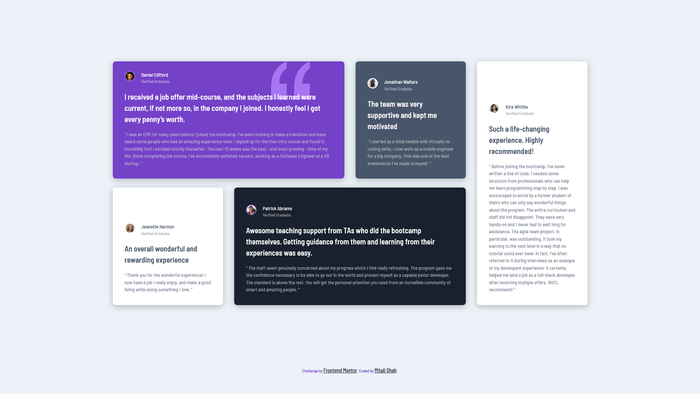

# Frontend Mentor - Testimonials grid section solution

This is a solution to the [Testimonials grid section challenge on Frontend Mentor](https://www.frontendmentor.io/challenges/testimonials-grid-section-Nnw6J7Un7). Frontend Mentor challenges help you improve your coding skills by building realistic projects.

## Table of contents

- [Overview](#overview)
  - [Screenshot](#screenshot)
  - [Links](#links)
  - [Built with](#built-with)
  - [Author](#author)

### Screenshot

### Links

- Solution URL: [https://github.com/MitaliShah/testimonials-grid-section](https://github.com/MitaliShah/testimonials-grid-section)
- Live Site URL: [https://mitalishah.github.io/testimonials-grid-section/](https://mitalishah.github.io/testimonials-grid-section/)

### Built with

- Semantic HTML5 markup
- Flexbox
- CSS grid
- Mobile-first workflow

## Author

- Frontend Mentor - [@MitaliShah](https://www.frontendmentor.io/profile/MitaliShah)
